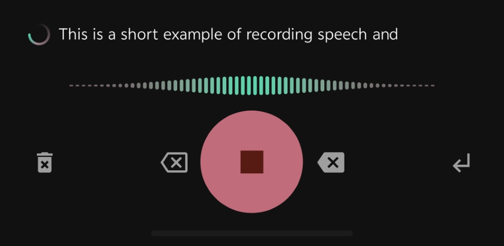
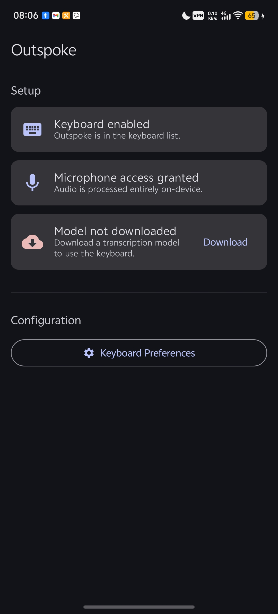
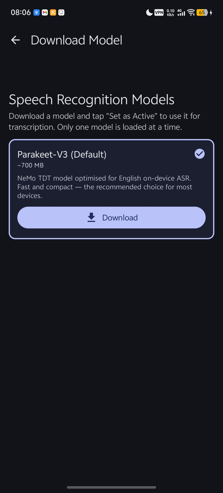
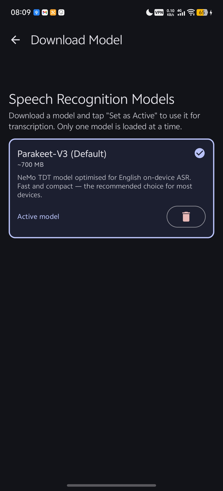
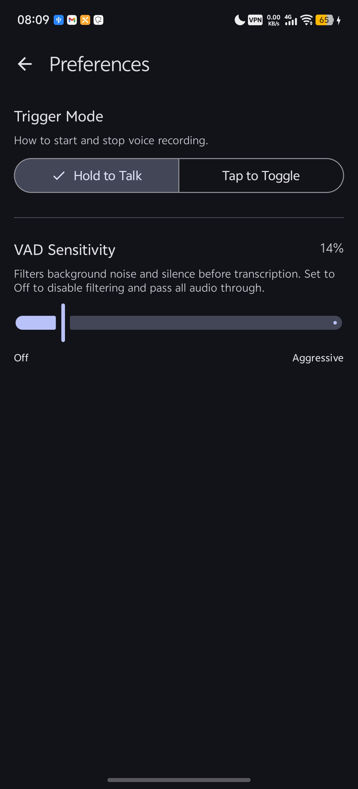
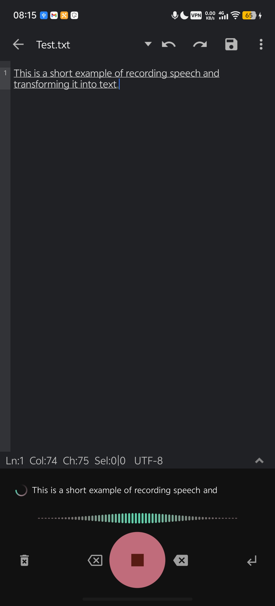

# Outspoke

<!-- Feature graphic scaled down to 600px width -->
<p align="start">
  
</p>

| [](https://apt.izzysoft.de/packages/dev.brgr.outspoke) | [](https://apt.izzysoft.de/packages/dev.brgr.outspoke) |
|----------------------------------------------------------------------------------------------------------------------------------------------------------------------------------------------------------------------|--------------------------------------------------------------------------------------------------------------------------------------------------------------------------------------------------------------------------------|

A privacy-focused speech-to-text keyboard(IME) for Android. Speech recognition runs entirely on-device - no internet needed after the initial model download, no account, no data leaving your phone.

It uses NVIDIA's [Parakeet-TDT v3](https://huggingface.co/nvidia/parakeet-tdt-0.6b-v3) automatic speech recognition model, quantized to INT8 and run via [ONNX Runtime](https://onnxruntime.ai/) for efficient on-device inference. Voice activity detection uses [Silero VAD v4](https://github.com/snakers4/silero-vad) (also ONNX, also fully on-device) to suppress silence before it ever reaches the ASR model.


## Screenshots
|  |  |  |
|--------------------------------------------------------------------------------|--------------------------------------------------------------------------------|--------------------------------------------------------------------------------|
|  |  |  |

---

## Features

- **Fully offline after setup** - audio is never transmitted anywhere
- **Real-time transcription** - progressive partial results while you speak
- **Works in any app** - injects text via Android's standard `InputConnection` API
- **Parakeet-TDT 0.6B v3** - INT8 quantized, ~700 MB, runs on mid-range hardware
- **Voice Activity Detection** - Silero VAD v4 neural network (ONNX) filters silence before it reaches the ASR model; falls back to energy-threshold VAD if the model can't load
- **Configurable trigger modes** - hold-to-talk or tap-to-toggle
- **No Google Play Services, no telemetry, no analytics**

---

## Requirements

| Requirement | Minimum                                                                |
|---|------------------------------------------------------------------------|
| Android version | 11 (API 30)                                                            |
| RAM | 4 GB recommended                                                       |
| Free storage | ~750 MB (for model files)                                              |
| Permissions | `RECORD_AUDIO`, `INTERNET` (model download only), `POST_NOTIFICATIONS` |

> The `INTERNET` permission is used **once** to download the model from Hugging Face. After that, the keyboard works fully offline.

---

## Getting Started

1. **Install** the APK from [Releases](../../releases) or build from source (see below).
2. **Open the Outspoke app** and follow the three setup steps:
   - Enable Outspoke in *System Settings → Keyboard / Input Methods*
   - Grant the microphone permission
   - Download the model (~700 MB, Wi-Fi recommended)
3. **Switch** to the Outspoke keyboard in any text field and tap the mic button.

---

## Architecture

Outspoke is structured as a clean layered pipeline. The `SpeechEngine` interface decouples all inference code from the service and audio layers - adding a new backend means implementing that one interface and nothing else.

```
┌─────────────────────────────────┐
│         Active App              │
│         (Text Field)            │
└──────────────┬──────────────────┘
               │  InputConnection API
┌──────────────▼──────────────────┐
│  OutspokeInputMethodService     │  ← Android IME service
│  (LifecycleOwner + Compose UI)  │
│  ┌───────────────────────────┐  │
│  │    KeyboardViewModel      │  │  ← UI state + capture lifecycle
│  └───────────────────────────┘  │
└──────────────┬──────────────────┘
               │  binds to
┌──────────────▼──────────────────┐
│       InferenceService          │  ← Foreground service (keeps engine alive)
│  ┌───────────────────────────┐  │
│  │    InferenceRepository    │  │  ← Sliding-window buffer (30 s max)
│  │  ┌─────────────────────┐  │  │
│  │  │   SpeechEngine      │  │  │  ← Interface (swap models here)
│  │  │   (ParakeetEngine)  │  │  │
│  │  └─────────────────────┘  │  │
│  └───────────────────────────┘  │
└──────────────┬──────────────────┘
               │  Flow<AudioChunk>
┌──────────────▼──────────────────┐
│    AudioCaptureManager          │  ← 16 kHz / 16-bit / mono PCM
│    SileroVadFilter              │  ← Neural VAD (Silero v4, ONNX)
│    RMSVadFilter                 │  ← Energy-threshold fallback
└─────────────────────────────────┘
```

### Key components

| Package | Class | Role |
|---|---|---|
| `inference` | `SpeechEngine` | Interface - model-agnostic contract for loading, transcribing, and closing any ASR engine |
| `inference` | `ParakeetEngine` | Implements `SpeechEngine` using three ONNX sessions (preprocessor → encoder → decoder/joint) |
| `inference` | `InferenceService` | `LifecycleService` that owns the engine and exposes `InferenceRepository` to bound clients |
| `inference` | `InferenceRepository` | Sliding-window inference driver: buffers audio chunks, waits for ≥ 2 s of context, then fires a partial inference every 1 s up to a 30 s hard ceiling; tracks the last 3 partials and performs **stable-chunk trims** when a common leading-word prefix is confirmed, emitting `TranscriptResult.WindowTrimmed` to `TextInjector`; force-trims on divergence loops (> 12 s) and silence runs (2 consecutive blank strides); applies a **post-processing pipeline** to every raw transcript (filler-word removal, stutter collapse ≥ 3×, phrase-loop deduplication, leading-dot / leading-punct stripping, trailing-dot normalisation, missing sentence-space repair, sentence-boundary capitalisation) |
| `audio` | `AudioCaptureManager` | Opens `AudioRecord`, emits 40 ms `AudioChunk`s as a cold `Flow`; drains hardware buffer and VAD hangover on stop |
| `audio` | `VadFilter` | Interface - common contract for VAD implementations (process, flush, isSpeechActive) |
| `audio` | `SileroVadFilter` | Neural VAD using Silero v4 (ONNX); preserves RNN state across chunks; primary filter when model is available |
| `audio` | `RMSVadFilter` | Energy-threshold VAD; used as fallback when Silero ONNX model can't load |
| `ime` | `OutspokeInputMethodService` | Core IME; wires Compose view tree, binds `InferenceService`, drives capture lifecycle |
| `ime` | `TextInjector` | Writes partial/final text into the focused field via `InputConnection`; keeps the last 6 words as a mutable composing span (underlined) and permanently freezes earlier words; delegates new-content discovery to `TranscriptAligner.findNewContent`; on `WindowTrimmed` performs a three-step reset (commit composing minus last 2 uncertain tail words, clear `lastPartial`, re-anchor `committedWords` from the actual field content); two-layer alignment recovery (field-scan → composing-commit fallback) prevents silent word drops on complete divergence |
| `ime` | `TranscriptAligner` | Stateless alignment utilities (`normalizeWord`, `splitToWords`, `findNewContent`); `findNewContent` uses a three-layer overlap search - (1) full prefix match, (2) suffix-prefix overlap ≥ 2 words, (3) interior scan ≥ 2 words - to locate genuinely new content in a fresh partial relative to already-committed words, tolerating Parakeet attention drift and post-trim leading garbage tokens |
| `ui` | `KeyboardViewModel` | Bridges IME lifecycle, audio capture, and inference results into `KeyboardUiState`; owns `captureJob` |
| `settings` | `ModelDownloadManager` | Downloads model files from Hugging Face over OkHttp with SHA-256 verification |
| `settings` | `ModelStorageManager` | Manages model file paths inside `filesDir` (no external storage permission needed) |

### Inference pipeline (Parakeet-TDT v3)

1. Raw PCM (16-bit signed) is normalised to `float32 [-1, 1]`
2. **`nemo128.onnx`** - computes 128-dim log-mel spectrogram features
3. **`encoder-model.int8.onnx`** - FastConformer encoder → `[B, 1024, T_enc]`
4. **`decoder_joint-model.int8.onnx`** - greedy TDT decoding with LSTM state carry-over
5. Token IDs are mapped to text via `vocab.txt`

Partial results are emitted every ~1 s once ≥ 2 s of audio is in the rolling window; the window grows up to a hard 30 s ceiling. After every partial the last 3 results are compared - if their leading words form a stable common prefix, the corresponding audio is trimmed from the front of the window (retaining 4 s of tail context) and `TranscriptResult.WindowTrimmed` is emitted so `TextInjector` can re-anchor its alignment state. Silence runs (2 consecutive blank strides) and divergence loops (window > 12 s with no common prefix) trigger unconditional force-trims. Every raw transcript passes through an 8-step post-processing pipeline before emission: filler-word removal → stutter collapse (≥ 3× repeats) → phrase-loop deduplication → leading-dot strip → leading-punct strip → multi-dot normalisation → missing sentence-space repair → sentence-boundary capitalisation. A final inference pass runs over the entire remaining window when recording stops; clips shorter than 1.25 s are zero-padded to give the encoder sufficient frames.

---

## Adding a New Model

To add a new model backend, implement the `SpeechEngine` interface:

```kotlin
interface SpeechEngine {
    val isLoaded: Boolean
    fun load(modelDir: File)
    fun transcribe(chunk: AudioChunk): TranscriptResult
    fun close()
}
```

To add, for example, a Whisper or Moonshine backend:

1. Create a new class implementing `SpeechEngine` (e.g. `WhisperEngine`).
2. Add a `ModelId` enum value and a `ModelInfo` entry in `ModelRegistry` - this covers display name, download URLs, file list, and size estimate.
3. Add a branch in `SpeechEngineFactory` to instantiate the new engine for that `ModelId`.

The repository and IME layers don't need to change.

---

## Building from Source

```bash
git clone https://github.com/minburg/outspoke.git
cd outspoke
./gradlew assembleRelease
```

**Requirements:** Android Studio Meerkat / Gradle 8+, JDK 11, Android SDK 34–36.

A debug build for sideloading:

```bash
./gradlew assembleDebug
# APK: app/build/outputs/apk/debug/app-debug.apk
```

---

## Permissions

| Permission | Why |
|---|---|
| `RECORD_AUDIO` | Capturing microphone input for speech recognition |
| `INTERNET` | One-time model download from Hugging Face (~700 MB) |
| `FOREGROUND_SERVICE` + `FOREGROUND_SERVICE_MICROPHONE` | Keeping the inference engine alive while the keyboard is in use |
| `POST_NOTIFICATIONS` | Showing the required foreground service notification |

No permission is used for any purpose beyond what is listed above.

---

## Privacy

- Audio stays on your device - all recognition runs locally via ONNX Runtime.
- No analytics, crash reporters, or third-party SDKs are included.
- No accounts or sign-in of any kind.
- The only network access is the one-time model download; this can be done manually if preferred (see [manual model installation](../../wiki/Manual-Model-Installation)).

---

## Contributing

Bug reports and pull requests are welcome. Please open an issue first for significant changes so we can discuss the approach.

- Follow the existing Kotlin code style (`kotlin.code.style=official`)
- Keep the `SpeechEngine` interface stable - new engines should be additive
- Unit tests for business logic live in `app/src/test/`

---

## License

This project is licensed under the **GNU General Public License v3.0**. See [LICENSE](LICENSE) for the full text.

The Parakeet-TDT model weights are distributed separately under [CC-BY-4.0](https://huggingface.co/nvidia/parakeet-tdt-0.6b-v3) by NVIDIA.
